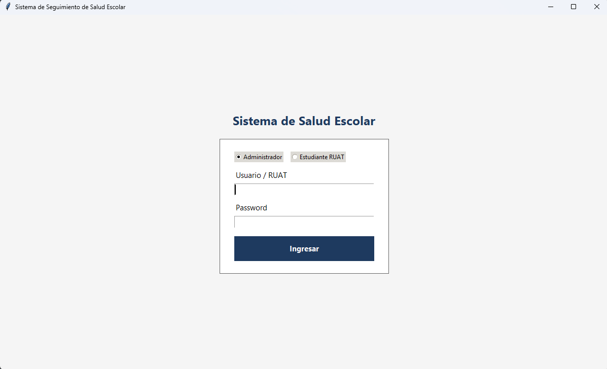
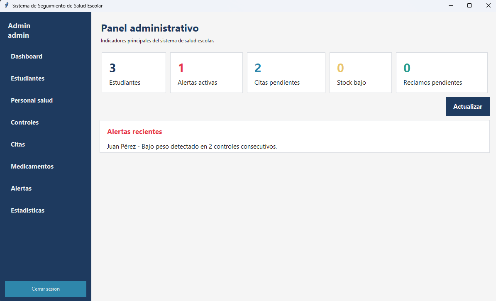

# Sistema de Seguimiento de Salud Escolar

Aplicacion de escritorio desarrollada en Python con Tkinter para administrar el seguimiento de salud de estudiantes en una unidad educativa. El sistema permite registrar estudiantes, personal de salud, controles medicos, citas, medicamentos, alertas y reclamos. Tambien incluye acceso separado para administradores y estudiantes.

## Vista general

El proyecto esta orientado al control escolar de salud. Desde el panel administrativo se pueden revisar indicadores principales como cantidad de estudiantes, alertas activas, citas pendientes, medicamentos con stock bajo y reclamos pendientes.





## Funcionalidades principales

- Login para administrador.
- Login para estudiante mediante nombre de usuario y password RUAT.
- Panel administrativo con indicadores generales.
- Gestion de estudiantes.
- Gestion de personal de salud.
- Registro y consulta de controles de salud.
- Calculo automatico de IMC desde peso y talla.
- Clasificacion nutricional: bajo peso, normal, sobrepeso y obesidad.
- Gestion de citas medicas escolares.
- Gestion de medicamentos y control de stock minimo.
- Generacion de alertas de salud.
- Reportes por curso con distribucion nutricional e IMC promedio.
- Panel de estudiante con perfil, historial, evolucion nutricional, citas, notificaciones y reclamos.
- Base de datos SQLite incluida en `data/salud_escolar.db`.

## Tecnologias usadas

- Python 3.
- Tkinter para la interfaz grafica.
- SQLite para almacenamiento local.
- bcrypt para contrasenas seguras.
- matplotlib para graficos de evolucion nutricional.

## Estructura del proyecto

```text
sistema-salud-escolar/
  main.py                         Punto de entrada de la aplicacion
  requirements.txt                Dependencias del proyecto
  config/                         Configuracion general, rutas, colores y fuentes
  controllers/                    Controladores entre vistas y servicios
  data/                           Base de datos SQLite
  database/                       Conexion, esquema, seeder y repositorios
  models/                         Modelos de dominio
  services/                       Logica de negocio
  utils/                          Utilidades auxiliares
  views/                          Vistas Tkinter
    admin/                        Pantallas del administrador
    estudiante/                   Pantallas del estudiante
    components/                   Componentes visuales reutilizables
  docs/                           Capturas de pantalla del sistema
```

## Instalacion

1. Extraer el archivo ZIP del proyecto.
2. Abrir PowerShell o CMD dentro de la carpeta `sistema-salud-escolar`.
3. Instalar dependencias:

```powershell
python -m pip install -r requirements.txt
```

## Ejecucion

Desde la carpeta raiz del proyecto:

```powershell
python main.py
```

Al iniciar se muestra la pantalla de login. Se debe seleccionar el tipo de acceso: `Administrador` o `Estudiante`.

## Credenciales de prueba

Administrador:

```text
Usuario: admin
Password: Admin123!
```

Estudiantes:

```text
Juan / 12345678
Ana / 23456781
Diego / 34567812
45678123 / 45678123
```

Todos los estudiantes usan como usuario su nombre registrado. Para los datos de prueba, la contrasena de cada estudiante es su codigo RUAT numerico de 8 digitos.

La base incluida tiene 24 estudiantes: 4 estudiantes por cada grado de `1ro` a `6to`.

## Base de datos

El sistema usa SQLite y trabaja con el archivo:

```text
data/salud_escolar.db
```

Tablas principales:

- `usuarios`
- `estudiantes`
- `personal_salud`
- `controles_salud`
- `medicamentos`
- `citas`
- `reclamos`

La estructura de tablas esta definida en `database/schema.py` y los datos iniciales en `database/seeder.py`.

## Modulos del administrador

- `Dashboard`: resumen de indicadores del sistema.
- `Estudiantes`: administracion de datos de estudiantes.
- `Personal salud`: registro del personal medico o de apoyo.
- `Controles`: controles de peso, talla, IMC y observaciones.
- `Citas`: programacion y seguimiento de citas.
- `Medicamentos`: inventario y stock minimo.
- `Alertas`: revision de alertas generadas por condiciones de salud.
- `Reportes`: reportes por curso, IMC promedio y distribucion nutricional.

## Modulos del estudiante

- `Mi panel`: resumen personal de salud.
- `Perfil`: datos del estudiante.
- `Historial`: controles registrados.
- `Evolucion`: graficos de evolucion nutricional.
- `Citas`: citas asociadas al estudiante.
- `Notificaciones`: avisos o alertas.
- `Reclamos`: registro y seguimiento de reclamos.

## Compilacion o verificacion

Este proyecto no necesita compilarse como una aplicacion tradicional, porque es Python. Para validar que los archivos no tengan errores de sintaxis se puede ejecutar:

```powershell
python -m compileall .
```

Para generar un ejecutable de Windows se puede usar PyInstaller:

```powershell
python -m pip install pyinstaller
pyinstaller --onefile --windowed main.py
```

El ejecutable se genera normalmente en:

```text
dist/main.exe
```

## Notas de uso

- Ejecutar siempre desde la carpeta raiz `sistema-salud-escolar`.
- No eliminar la carpeta `data`, porque contiene la base de datos.
- Si se crea un ejecutable, verificar que la base de datos SQLite se distribuya junto con la aplicacion.
- El boton `Cerrar sesion` vuelve al login.
- Al cerrar la ventana, la aplicacion cierra la conexion SQLite de forma limpia.

## Autor

Proyecto academico: Sistema de Seguimiento de Salud Escolar.
